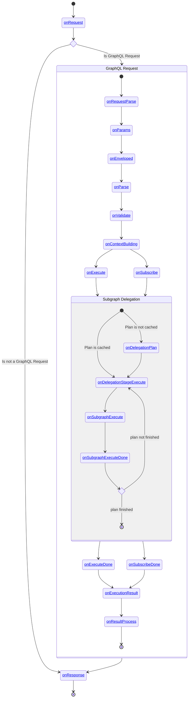

import { Callout } from '@theguild/components'

# Plugins

Hive Gateway is built with an highly modular architecture. The core is as small as possible, and
most of the feature are built around a plugin system.

A plugin can hook into each important steps of the lifecycle of the gateway, including the graphql
request execution.

The gateway is built using Graphql Yoga (a GraphQL HTTP server) and Envelop (a GraphQL execution
orchestrator), which are also highly modular technologies. Hive Gateway is extending Yoga and
Envelop plugin system by providing gateway specific hooks.

This means that if a plugin exists in multiple variants, you should follow this priority order:

1.  Hive Gateway: is aware of subgraphs and upstream request management.
2.  Yoga: is aware of the HTTP transport. It most of the time provides optimisations over the
    Envelop variants.
3.  Envelop: is only aware of the GraphQL operation execution.

For example, the Prometheus integration plugin is available for Envelop (`@envelop/prometheus`),
Yoga(`@graphql-yoga/plugin-prometheus`) and Hive Gateway(`@graphql-mesh/prometheus`). In this case,
you should pick `@graphql-mesh/prometheus` plugin. It is built on top of Yoga and Envelop variants,
but adds monitoring capabilities of upstream subgraphs.

For the most used features, you will not have to explicitly setup the dedicated plugin. They will be
added automatically based on your gateway configuration.

## Configuration

You can add plugins to your gateway using the `plugins` option.

It have to be a function, which will be called each time the gateway have update its configuration.
For example, if polling is enabled, this function will be called for each poll.

Most Hive Gateway plugins takes an object as a parameter, and expect some common components like a
`logger`, a `pubsub`, etc... Those components are given in parameters to the `plugins` function. It
is advised to spread the plugin's factory context into the plugins options, this way plugins will
have access to all components they need.

```ts filename="gateway.config.ts"
import { useGraphQLJit } from '@envelop/graphql-jit'
import { defineConfig } from '@graphql-hive/gateway'
import useNewRelic from '@graphql-mesh/plugin-newrelic'

export const gatewayConfig = defineConfig({
  plugins: ctx => [
    useGraphQLJit(),
    useNewRelic({
      ...ctx
      // other options
    })
  ]
})
```

## Custom Plugins

You can take advantage of the plugin system to create your own custom plugin. This allows you to
integrate your gateway with any technology that we don't officially support, being public or private
to your company.

A good entry-point for discovering how to write Gateway plugins is to look at the source code of the
existing plugins maintained by us.

A plugin is an object that can define methods to hook into different phases or events of the gateway
lifecycle. Each hook will receive a single parameter, the hook payload, containing data related to
the hooked phase and functions allowing you to modify the behavior of this phase.

There are 2 categories of hooks:

- Gateway lifecycle hooks: they are related to the lifecycle or events of the server itself and is
  not related to a specific request.
- Request lifecycle hooks: they are tight to a specific phase of a specific request. Those hooks
  always give access to the related request in there payload.

### Gateway lifecycle

Gateway lifecycle allows to setup long running services, initialize in-memory cache or stores, react
to general events.

#### `onYogaInit`

It is the very first hook called just before the gateway starts listening for HTTP requests.

##### Possible usages

You can use this hook to customize the Yoga instance.

##### API

- `yoga`: `YogaServer` instance that is about to start with the gateway.

#### `onPluginInit`

This hook is called before the server starts listening to HTTP requests.

##### Possible usages

In this hook, you can initialize every long running components, such as values stores, cache, third
party clients, etc...

You can add other plugin in this hook, which allow you to ensure plugins you depends on are present.

##### API

- `addPlugin(plugin: Plugin)`: allow to add a plugin to the plugin list. The new plugin will be
  added in place in the list, just after the one calling this function. It is possible to call this
  function multiple times. In this case, plugin order is preserved.
- `plugins: Plugin[]`: the current list of plugins. It can be used to verify if a plugin you depends
  on is already in the list, or to verify your plugin is not present twice. This should never be
  mutated, please use `addPlugin` function instead.
- `setSchema(schema: GraphQLSchema)`: allows to replace the current schema
- `registerContextErrorHandler(handler)`: registers a handler that will be called if the GraphQL
  context factory throws an error. It's useful for error reporting for example.

#### `onSchemaChange`

This hook is called when the schema changes, either because the Gateway loaded it the first time, or
because a plugin changed it.

##### Possible usages

- Monitor changes of schemas
- Analyse the schema or keep track of it for other hooks
- Modify the schema

##### API

- `schema`: The new loaded schema
- `replaceSchema`: replace the schema. This will trigger a new call to `onSchemaChange`, so you
  should keep track of schema already modified by your plugin to avoid infinite change loop.

#### `onFetch`

This hook is called each time the `fetch` function is called. It can be either a request to an
upstream subgraph using the http transport, or a request made a plugin to a third party technology.

##### Possible usages

- Manipulate HTTP [`Request`](https://developer.mozilla.org/en-US/docs/Web/API/Request) object
- Manipulate HTTP [`Response`](https://developer.mozilla.org/en-US/docs/Web/API/Response) object
- Change [`fetch`](https://developer.mozilla.org/en-US/docs/Web/API/Fetch_API) implementation
- Add custom headers
- Monitor the HTTP request

##### API

- `url`: The target URL of the request
- `setUrl`: replace the target URL
- `options`: the `fetch` function options
- `setOptions`: replace the options that will be used to send the request
- `info`: the GraphQL operation info
- `fetchFn`: the fetch function that will be used to make the request. By default, it is the one
  provided in the Gateway configuration if provided, or `@whatwg-node/fetch` if not.
- `setFetchFn`: replace the `fetch` function that will be used to make the request. It should be
  compatible with standard `fetch` API.
- `executionRequest`: present only if the request is an upstream subgraph request. It contains all
  information about the upstream query, notably the target subgraph name.
- `requestId`: a uniq id identifying the client request. This is used to correlate downstream and
  upstream request across services.
- `logger`: The logger instance for the specific request that includes the details of the request
  and the response.

#### `Symbol.asyncDispose` or `Symbol.dispose`

In order to clean up resources when Hive Gateway is shut down, you can use `Symbol.asyncDispose` or
`Symbol.syncDispose` to clean up resources.

```ts
export const useMyPlugin = () => {
  return {
    async [Symbol.asyncDispose]() {
      // Clean up resources
      await stopConnection()
    }
  }
}
```

You can learn more about
[Explicit Resource Management](https://www.typescriptlang.org/docs/handbook/release-notes/typescript-5-2.html#using-declarations-and-explicit-resource-management)
here.

### Request Lifecycle

The following diagram shows the lifecycle of request in Hive Gateway.

Each hook is given a single parameter called payload. Please see detail section of each hook to know
what contains each of this payloads.

<div className="[&_a]:text-primary [&_a]:underline [&_a:hover]:no-underline [&_a]:decoration-from-font [&_a]:[text-underline-position:from-font]">



</div>

### `onRequest`

This hook is invoked for ANY incoming HTTP request. Here you can manipulate the request or create a
short circuit before Yoga handles the request.

<Callout type="warning">

Exceptions thrown by this hook are not caught. This means they will buble up to the HTTP server
underlying implementation.

For example, the `node:http` server crashes the entire process on uncaught exceptions.

Prefer `onRequestParse` when possible, or wrap the hook code in a `try` block.

</Callout>

**Example actions in this hook:**

- Manipulate the request
- Short circuit before Yoga handles the request

#### API

- `request`: The incoming HTTP request as WHATWG `Request` object.
  [Learn more about the request](https://developer.mozilla.org/en-US/docs/Web/API/Request).
- `serverContext`: The early context object that is shared between all hooks and the GraphQL
  execution. [Learn more about the context](/docs/features/context).
- `fetchAPI`: WHATWG Fetch API implementation.
  [Learn more about the fetch API](https://developer.mozilla.org/en-US/docs/Web/API/Fetch_API).
- `url`: WHATWG URL object of the incoming request.
  [Learn more about the URL object](https://developer.mozilla.org/en-US/docs/Web/API/URL).
- `endResponse`: A function that allows you to end the request early and send a response to the
  client.

#### Example

```ts
import type { GatewayPlugin } from '@graphql-hive/gateway'

function useAuth(): GatewayPlugin {
  return {
    onRequest({ request, fetchAPI, endResponse }) {
      if (!request.headers.get('authorization')) {
        endResponse(
          new fetchAPI.Response(null, {
            status: 401,
            headers: {
              'Content-Type': 'application/json'
            }
          })
        )
      }
    }
  }
}
```

### `onRequestParse`

This hook is invoked for any incoming GraphQL HTTP request and is invoked before attempting to parse
the GraphQL parameters. Here you can manipulate the request, set a custom request parser or apply
security measures such as checking for access tokens etc.

**Example actions in this hook:**

- Manipulate the request
- Set custom GraphQL request parser (use custom GraphQL protocol)
- Apply security measures

### `onParams`

This hook is invoked for an incoming GraphQL request after the GraphQL parameters (`query`,
`variables`, `extensions` and `operationName`) have been ATTEMPTED to be parsed.

Within this hook you can manipulate and customize the parameters or even implement a whole new way
of parsing the parameters (if you wish to diverge from the GraphQL over HTTP specification).

In addition to that you could also short-circuit and skip the GraphQL execution. E.g. you might want
to serve a result from the cache instead.

**Example actions in this hook:**

- **[Response Cache](/docs/features/response-caching)**: Short-circuit GraphQL execution if response
  can be served from the cache.
- **[Persisted Operations](/docs/features/persisted-operations):** Load the `query` document string
  from the persisted operations store before running the execution.
- **[APQ](/docs/features/automatic-persisted-queries):** Load/persist the `query` document string on
  the persisted operations store.

### `onParse`

Called for parsing the GraphQL document. This hook has a before and after stage. You can hook into
before the document is parsed and/or into after the document is parsed.

**Example actions in this hook:**

- Replace GraphQL parser and support future GraphQL syntax
- Collect metrics about parsing success/failures

### `onValidate`

Called for validating the GraphQL document. This hook has a before and after stage. You can hook
into before the document is parsed and/or into after the document is parsed.

**Example actions in this hook:**

- Register additional validation rules (e.g. [Disable Introspection](/docs/features/introspection))
- Collect metrics about validation success/failures

### `onContextBuilding`

Called for building the GraphQL context. This hook has a before and after stage. You can hook into
before and after the context is built.

**Example actions in this hook:**

- Authentication
- Add data to context object (e.g. user data or dataloader instances)

### `onExecute`

Called for executing a GraphQL mutation or query operation. This hook has a before and after stage.
You can hook into before and after the GraphQL request is executed.

**Example actions in this hook:**

- Collect metrics about execution time
- Error logging/reporting

### `onSubscribe`

Called for subscribing to a GraphQL subscription operation. This hook has a before and after stage.
You can hook into before and after the GraphQL subscription is executed.

**Example actions in this hook:**

- Collect metrics about execution time
- Error logging/reporting

### `onExecutionResult`

This hook is invoked for each result produced for GraphQL operation, before it is processed to be
sent to client.

In particular, it is useful to handle batched operations. If a request contains batched operations,
this hook is called once of each operation, while `onResultProcess` will be only called once for the
entire request.

Here, you can modify the result, to add monitoring or instrumentation extensions for example.

**Example actions in this hook:**

- Add metadata to results
- Collect errors

### `onResultProcess`

This hook is invoked after a GraphQL request has been processed and before the response is forwarded
to the client. Here you can customize what transport/response processor format should be used for
sending the result over the wire.

**Example actions in this hook:**

- Specify custom response format
- Logging/Metrics

### `onResponse`

This hook is invoked after a HTTP request (both GraphQL and NON GraphQL) has been processed and
after the response has been forwarded to the client. Here you can perform any cleanup or logging
operations, or you can manipulate the outgoing response object.

<Callout type="warning">

Exceptions thrown by this hook are not caught. This means they will buble up to the HTTP server
underlying implementation.

For example, the `node:http` server crashes the entire process on uncaught exceptions.

Prefer `onRequestParse` when possible, or wrap the hook code in a `try` block.

</Callout>

**Example actions in this hook:**

- Specify custom response format
- Logging/Metrics

#### API

- `request`: The incoming HTTP request as WHATWG `Request` object.
  [Learn more about the request](https://developer.mozilla.org/en-US/docs/Web/API/Request).
- `serverContext`: The final context object that is shared between all hooks and the GraphQL
  execution. [Learn more about the context](/docs/features/context).
- `response`: The outgoing HTTP response as WHATWG `Response` object.
  [Learn more about the response interface](https://developer.mozilla.org/en-US/docs/Web/API/Response).

#### Example

```ts
import type { GatewayPlugin } from '@graphql-hive/gateway'

function useGatewaySignature(): GatewayPlugin {
  return {
    onResponse({ request, response }) {
      response.headers.set('X-GraphQL-Server', 'Yoga')
    }
  }
}
```

#### `onSubgraphExecute`

This hook is invoked for ANY request that is sent to the subgraph.

##### Possible usages

- Manipulate the request
- Add a custom auth header
- Monitor the subgraph request

You can see [Prometheus plugin](/docs/gateway/authorization-authentication) for an example of how to
use this hook.

##### API

### Plugin Context

Hive Gateway comes with ready-to-use `logger`, `fetch`, cache storage and etc that are shared across
different components. We'd highly recommend you to use those available context values instead of
creating your own for a specific plugin.

```ts filename="gateway.config.ts"
import { defineConfig } from '@graphql-hive/gateway'

export const gatewayConfig = defineConfig({
  plugins({
    fetch, // WHATWG compatible Fetch implementation.
    logger, // Logger instance used by Hive Gateway
    cwd, // Current working directory
    pubsub, // PubSub instance used by Hive Gateway
    cache // Cache storage used by Hive Gateway
  }) {
    return [
      useMyPlugin({ logger, fetch }) // So the plugin can use the shared logger and fetch
    ]
  }
})
```

## Example Additional Plugin (SOFA)

GraphQL SOFA allows you to generate a fully documented REST API from your GraphQL schema. This is
useful when you need to support REST clients or when you want to expose a REST API to the public.

- **Don’t choose between REST and GraphQL**
- Get most of the **benefits of GraphQL** on the backend and frontend, while using and **exposing
  REST**
- **Support all your existing clients** with REST while improving your backend stack with GraphQL
- Create custom, perfectly client-aligned REST endpoints for your frontend simply by naming a route
  and attaching a query
- In the other way around (REST to GraphQL) you won’t get the best of both worlds. Instead just less
  powerful, harder-to-maintain server implementations with a some of the benefits of GraphQL. It can
  be a good and fast start for a migration though.
- Fully **generated documentation** that is always up-to-date
- **GraphQL Subscriptions as Webhooks**

## Installation

```sh npm2yarn
npm i @graphql-yoga/plugin-sofa
```

## Quick Start

```ts filename="gateway.config.ts"
import { defineConfig } from '@graphql-hive/gateway'
import { useSOFA } from '@graphql-yoga/plugin-sofa'

export const gatewayConfig = defineConfig({
  plugins: pluginCtx => [
    useSOFA({
      // The path where the REST API will be served
      basePath: '/rest',
      // The path where the Swagger UI will be served
      swaggerUIEndpoint: '/rest/docs',
      // OpenAPI Document details
      info: {
        title: 'My API',
        description: 'My API Description',
        version: '1.0.0'
      }
    })
  ]
})
```

[Learn more about SOFA](https://the-guild.dev/graphql/sofa-api/docs)

<Callout>
  You can consume the API using [feTS Client](https://the-guild.dev/openapi/fets/client/quick-start)
  without any code generation!
</Callout>
