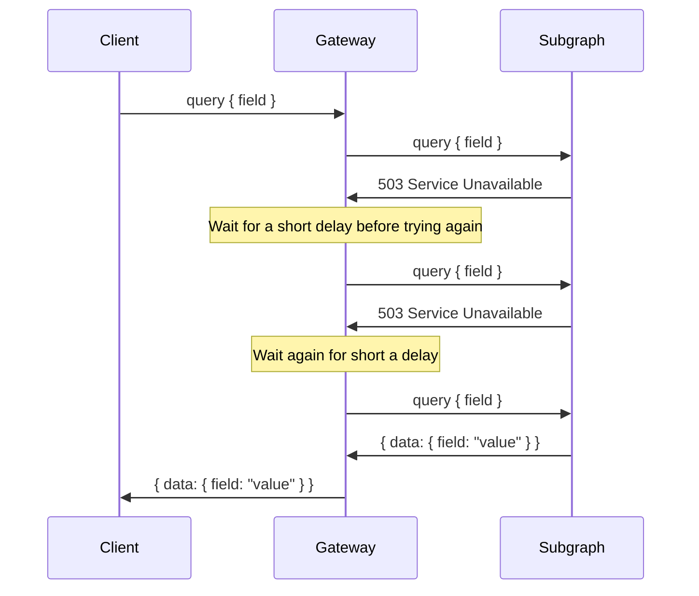

# Upstream reliability

Hive Gateway offers Retry and Timeout features to improve the reliability of the traffic between the
gateway and the subgraphs.

## Retry

A large range of errors happening between the gateway and the upstream subgraphs are temporary
errors. Which means a lot of errors can be solved by issuing the same request again after a short
delay.

The Retry feature allows to automatically retry failed upstream requests, improving the ratio of
successful responses from the client point of view.



### Configuration

This feature can be enabled for all subgraphs at once by using `upstreamRetry` option.

The only mandatory option to provide is the number of maximum retries allowed.

Once enabled, any upstream request execution failing with an exception will be retried, with a delay
of 1 second between each try.

If the upstream is using the `fetch`, the request will be retried only if the status code is `429`,
`5XX`, or if the `Retry-After` header is present in the response. If the `Retry-After` header is
present, the delay between retries will respect it, otherwise it defaults to 1 second.

```ts filename="gateway.config.ts"
import { defineConfig } from '@graphql-hive/gateway'

export const gatewayConfig = defineConfig({
  upstreamRetry: {
    maxRetries: 3
  }
})
```

#### Configuration by subgraph

Hive Gateway lets you define different retry policy for each subgraph by providing a function to the
`upstreamRetry` option

This function will be called for each upstream request, which allows you to have full control of the
retry policy.

```ts filename="gateway.config.ts"
import { defineConfig } from '@graphql-hive/gateway'

export const gatewayConfig = defineConfig({
  upstreamRetry: ({ subgraphName }) => {
    if (subgraphName == 'very-unreliable-subgraph') {
      return {
        maxRetries: 10
      }
    }

    return {
      maxRetries: 3
    }
  }
})
```

#### `shouldRetry`

Hive Gateway offer the possibility to skip retrying a specific upstream request, based on its
context or returned value.

For example, you can make Hive Gateway always retry any response with an error HTTP status code (>=
400).

```ts filename="gateway.config.ts"
import { defineConfig } from '@graphql-hive/gateway'

export const gatewayConfig = defineConfig({
  upstreamRetry: {
    maxRetries: 3,
    shouldRetry: ({ response }) => response?.status >= 400 // Always retry any HTTP errors
  }
})
```

#### `retryDelay`

The default delay to wait between tries.

If the upstream execution is using `fetch`, the delay is replaced by the response's `Retry-After`
header if present.

The `Retry-After` can either contain a number of second, or a date.

```ts filename="gateway.config.ts"
import { defineConfig } from '@graphql-hive/gateway'

export const gatewayConfig = defineConfig({
  upstreamRetry: {
    maxRetries: 3,
    retryDelay: 1000 // delay in milliseconds
  }
})
```

## Timeout

An upstream request timeout limit is the maximum time the gateway waits for a response from an
upstream subgraph before aborting the request. This ensures the gateway remains responsive and
prevents it from waiting indefinitely for a slow or unresponsive subgraphs.

### Configuration

Hive Gateway allows to configure a global timeout for all subgraphs at once.

```ts filename="gateway.config.ts"
import { defineConfig } from '@graphql-hive/gateway'

export const gatewayConfig = defineConfig({
  // The maximum time in milliseconds to wait for a response from the upstream.
  upstreamTimeout: 1000
})
```

#### Configuration by subgraph

You can finely grain configure the timeout for each upstream execution request by providing a
function instead of a number.

This function is called for each upstream request, allowing for complete control over the timeout
strategy.

```ts filename="gateway.config.ts"
import { defineConfig } from '@graphql-hive/gateway'

export const gatewayConfig = defineConfig({
  upstreamTimeout: ({ subgraphName }) => {
    if (subgraphName == 'very-slow-subgraph') {
      return 60_000 // Allow for longer request for this very slow server
    }
    return 30_000
  }
})
```

## Mixing Retry and Timeout

If Retry and Timeout are both enabled at the same time (which is recommended), the timeout will be
applied to each try.

It also means that a timed-out request will be retried, until the maximum retry count is reached,
respecting the retry delay between tries.

If you prefer to have a timeout spanning over the retries, to ensure a maximum execution time for an
execution request, you can manually add the plugin to your configuration.

```ts filename="gateway.config.ts"
import { defineConfig, useUpstreamRetry, useUpstreamTimeout } from '@graphql-hive/gateway'

export const gatewayConfig = defineConfig({
  plugins: () => [
    useUpstreamRetry({
      maxRetries: 10
      retryDelay: 1_000,
    }),
    useUpstreamTimeout(10_000)
  ]
})
```
