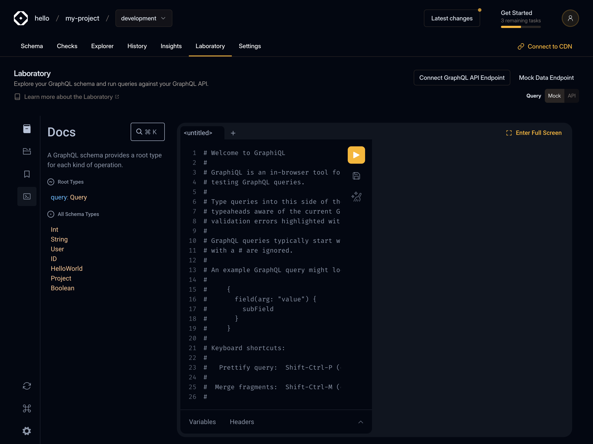

import { Callout } from '@theguild/components'

We've added Preflight Scripts to Laboratory! These scripts allow you to automatically run custom
authentication processes before executing your GraphQL operations. They're especially useful for
handling authentication flows like OAuth, where you may need to refresh an access token. Let's
explore how it works.

export function Caption({ children }) {
  return <p className="text-center text-sm italic">{children}</p>
}

## Configuring Preflight Script

To create a script click on the command line icon (right after Operation Collections plugin icon) in
GraphiQL sidebar section.



{/* prettier-ignore */}
<Caption>The preflight script is accessible by clicking on the Command line icon in the GraphiQL sidebar</Caption>

You will see Script editor (JavaScript language) which is read-only and present for a quick view of
your saved script and Environment variables editor (JSON language) which is persistent in
localStorage.


<Caption>Preflight script plugin view</Caption>

## Editing Preflight Script

Clicking on the `Edit` button will open Modal where you can edit, test and save your script in
database.

<Callout type="warning">
  **Note**: Your script will stored as plain text in our database, don't put any secrets there, use
  Environment variables editor for it! The preflight script is accessible to all members of your
  organization, but only users with access to target Settings can edit the script code.
</Callout>

You can use any JavaScript syntax (including top-level `await`) in the Script editor. Getting and
Setting environment variables is done by accessing the `environment` property on the `lab` global
variable.

```js
// get myKey variable from the Environment variables editor
lab.environment.get('myKey')
// set myKey variable to the Environment variables editor (persistent in localStorage)
lab.environment.set('myKey', myValue)
```


<Caption>Demo how to get and set environment variables</Caption>

## CryptoJS

Additionally, you can access the CryptoJS library by accessing the `CryptoJS` property on the `lab`
global variable.


<Caption>CryptoJS</Caption>

## Global Variables and Errors

Access to global variables such as `this`, `window` or `globalThis` are restricted, errors which
will throw from a script will be visible in Console Output.


<Caption>Demo restricted access to global variables</Caption>

## Using Environment Variables in Headers Editor

To use your environment variables in GraphiQL headers editor wraps environment keys with
double-curly braces, e.g.:

```json filename="Headers" /{{myEnvVar}}/
{
  "Authorization": "Bearer {{myEnvVar}}"
}
```


<Caption>Replace syntax is done via double open/closed curly braces, e.g. `{{ myEnvVar }}`</Caption>

## Summary

Preflight Scripts in the Laboratory enables the automatic execution of custom authentication
processes prior to GraphQL operations. This feature is particularly beneficial for managing
authentication flows, such as OAuth, where access tokens may need to be refreshed.

### Key Takeaways

1. Setting Up Preflight Scripts:

   - Access the script editor by clicking the command line icon in the GraphiQL sidebar.
   - The editor supports modern JavaScript syntax.

1. Editing Scripts:

   - Users can edit, test, and save scripts through a modal interface.
   - **Important**: Avoid storing secrets directly in the script; instead, use the Environment
     Variables editor.

1. Environment Variables:

   - Access environment variables with `lab.environment.get()` and `lab.environment.set()`.
   - These variables can be used in headers by enclosing them in double curly braces (e.g.,
     `{{myEnvVar}}`).

1. CryptoJS Library:

   - The CryptoJS library is accessible via the lab global variable for cryptographic functions.

1. Global Variables Access:

   - Access to certain global variables like `this` or `window` is restricted, with any errors
     displayed in the Console Output.
